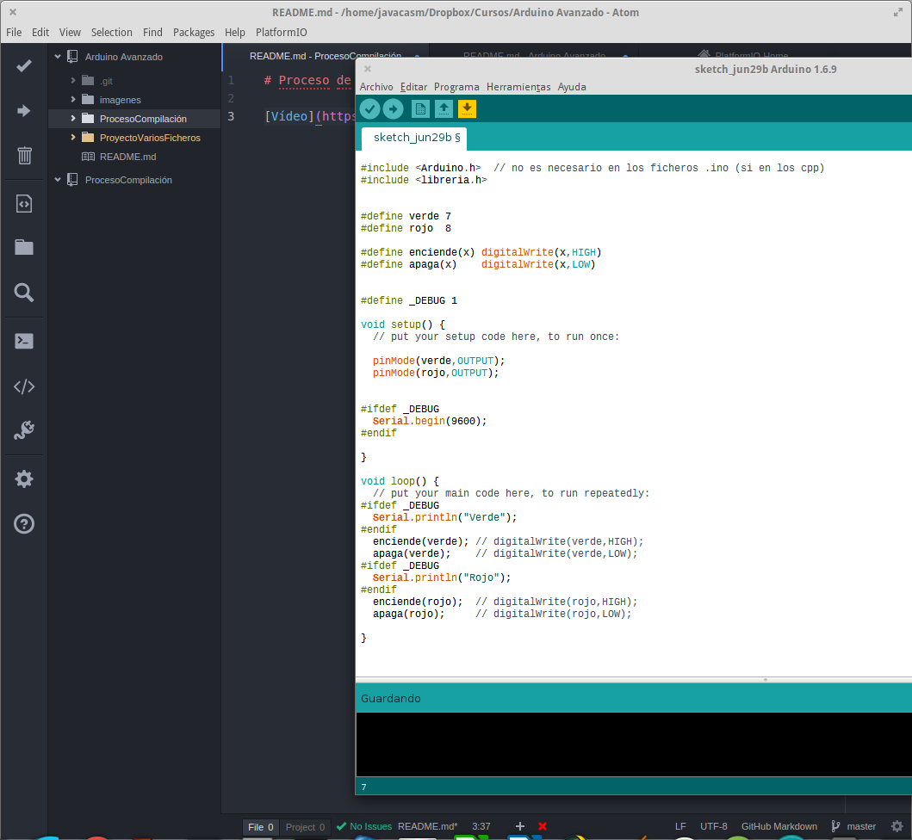

# Proceso de compilación en C++ y en Arduino

# Fases del proceso de compilación

## Preprocesado
* Includes: se includen todos los ficheos (de manera recursiva, el include  que include un fichero...)
* Defines: se sustituyen las etiquetas por su valor
* Directivas de preprocesado: se validan y se decide qué código se usa y cual no

## Compilado: se valida la sintaxis
## Enlazado ("Linkado"): se juntan todas las partes (de los diferentes ficheros) y de las librerías usadas

[Vídeo](https://youtu.be/ODG07Y9SIHc)

[Ejemplo](./Preprocesador/Preprocesador.ino)
